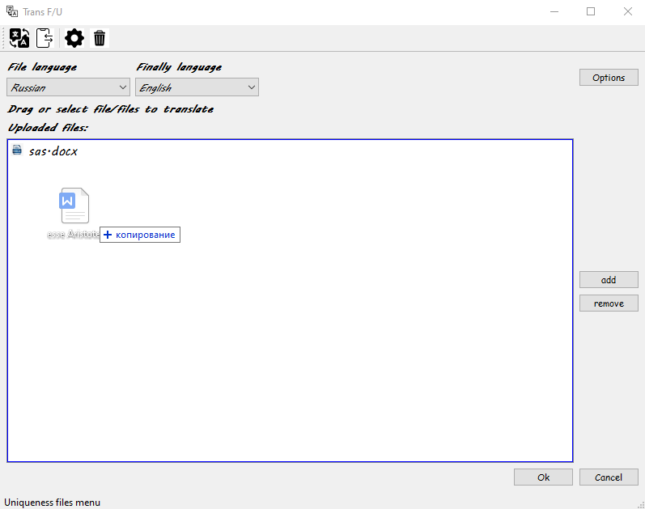
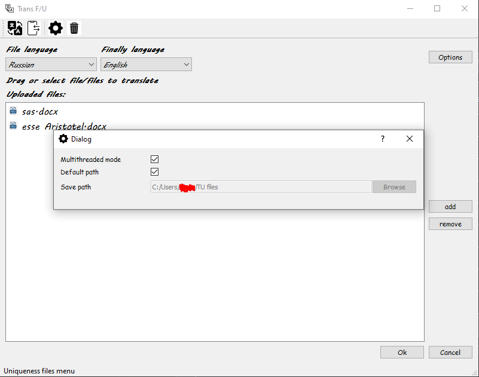
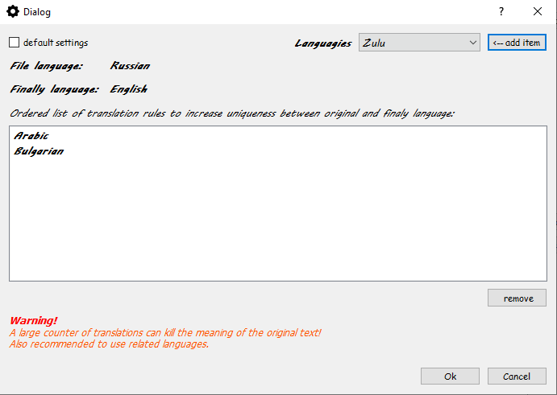
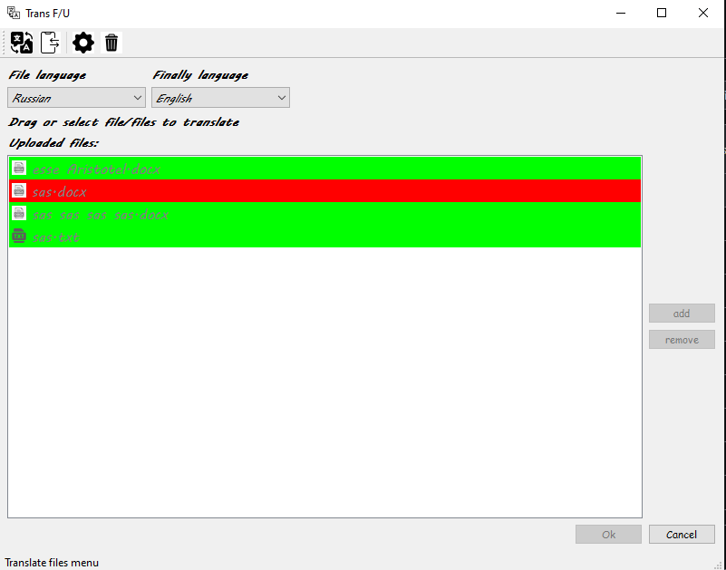

# File_TU

<strong>Программа для перевода и повышения уникальности текста. 
Потдерживаемый формат файлов: <em>.txt</em> и <em>.docx</em>.<strong>

Данная программа переводит файлы и сохранять их копии в папке, путь к которой выберет пользователь. 
Все, что для этого нужно, это указать язык исходного файла и язык перевода. 
Добавить нужные файлы можно через диалоговое окно или просто перетащить их в специальное поле.  
Эту программу можно использовать и для повышения уникальности текста: в этом режиме текст из файла подвергается многократному  переводу, 
алогоритм перевода представляет собой упорядоченный список по которому производится перевод. 
Этот список пользователь может составить по своему усмотрению. 
Так же нужно указать язык переводимого и получаемого файла (можно/нужно выбрать один и тот же)

<strong>Предупреждение: </strong>
В режиме повышения уникальности может потеряться смысл исходного текста, будьте внимательны и проверяйте полученный файл!

    
    
<h2>Как собрать или установить</h2>

Я очень постаралься, чтобы этот проект собрать мог только я, так что в папке <em>build</em> есть 
уже релизная версия, собранная на ОС <em>Windows 10</em>

Для начала нужно скомпилировать скрипт <em>"translateModule/main.py"</em> 
в исполняемый файл<em>"translateModule/TU.exe"</em>. 
Перед этим нужно создать виртуальное окружение в папке со скриптом и загрузить следущие пакеты через <em>pip install</em>:
<pre lang="no-highlight" class="notranslate">
<code><em>pip install googletrans==3.1.0a0
pip install python-docx
</em></code></pre>
    
Далее в этом же виртуальном окружении используем утилиту  
<a href="https://pypi.org/project/auto-py-to-exe">auto-py-to-exe

    

Затем воспользуемся <em>qmake</em>: 
С помощью Qt Creator откроем <em>translateFile.pro, укажем компилятор mingv 32</em> 
и в настройках проекта выберем теневую сборку или же укажем корневую папку. 
Чтобы приложение можно было использовать вне среды Qt, 
то нужно воспользоваться статической сборкой. Если статическая сборка не поддерживается, то нам необходимо добыть 
нужные dll библиотеки из папки в которой установлен Qt: <em>"Qt\your version - 5.12.12\mingw73_32\bin".</em>
Чтобы узнать недостающие библиотеки попробуйте запустить собранный проект.

<h2>Подробнее о программе</h2>
    <ul style="list-style-type:none;">
        <li><a href="#info0">Немного о реализации</a></li>
        <li><a href="#info1">Основное меню</a></li>
        <li><a href="#info2">Настройки программы</a></li>
        <li><a href="#info3">Конечный результат</a></li>
    </ul>
    
    
<h3 id="info0">Немного о реализации</h3>
    

Программа разделена на 2 модуля:
    <ol style="list-style-type:none;">
        <li>Модуль переводчика</li>
        <li>Отслеживающий, интерфейсный модуль</li>
    </ol>
    

Модуль переводчика - это консольное приложение, написанное на Python3.
Эта подпрограмма принимает в качестве параметров путь к файлу, путь сохранения и список языков в виде ключей.
Перевод осуществляется с помощью API google translator.

    

Отслеживающий модуль отвечает за сбор пользовательских данных с интерфейса и преобразование этих данных 
в аргументы для переводчика. 
Во время основного проесса в нескольких потоках отслеживается результат перевода. В случае ошибки,
удаления пользователем файла или потрери соединения, поток завершается с уведомлением об этом пользователю.
При закрытии приложения все настройки сохраняются. Также реализована локальная история,
чтобы всегда можно было вернуться к предыдущим настройкам в самой программе.

<h3 id="info1">Основное меню</h3>

<h3 id="info2">Настройки программы</h3>

<h3 id="info3">Конечный результат</h3>

